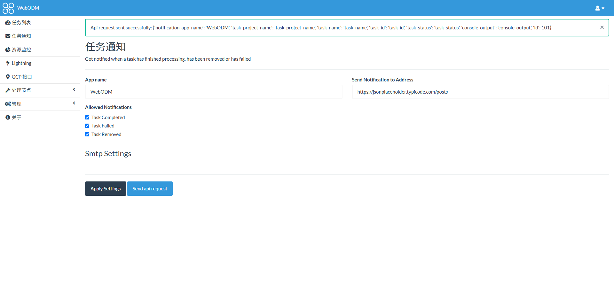

# Introduce
This plugin is made for the API requests of WebODM. You can set an API URL in this plugin, and when the task is completed, fails, or has been removed, this plugin will use the POST method to request the URL you have set.

# How to use
Just zip this entire project, then go to WebODM's plugin webpage and click the import plugin (.zip) button. After that, refresh the page or restart WebODM.

# Plugin
